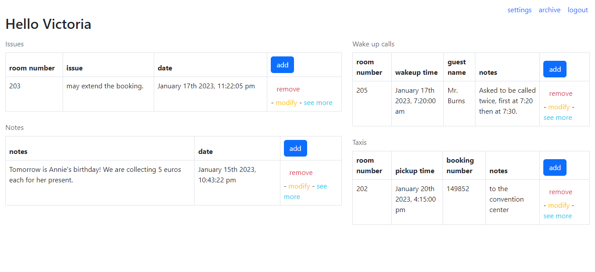

# Front Desk Logger

Some years ago I worked at the reception of a hotel and one of the things we used to find tricky leaving notes for next shifts. We used to write down everything on a paper or little notebook and pass that over. A lot of times we found ourselves trying to understand what the other person wrote or which notes were new and which ones were old. Keeping this struggle in mind I build the app I wish I had back then.

**The Link to project:** https://dark-lime-pigeon.cyclic.app/

## How it works:

This app allows the manager of the hotel to create an account for them and their hotel. Inside of their account they can add their employees. The employees can login into their accounts after the manager made it for them and they can all see the feed of what it's happening in the hotel. This Feed includes 4 topics: issues, notes, taxis booked and wake up calls. Once the note/issue or other item are not relevant any more, they can remove from the feed, but they can find it in the archive in case they need to check it. 

## How It's Made:

**Tech used:** Node js, Express, Mongodb, Mongoose, EJS, CSS, Passport, Bootstrap

I built this MVP following the MVC pattern with Nodejs as server environment and Express as framework. For the views I used EJS, I really enjoy using it as it reminds me of PHP. For dealing with the database it uses Mongoose as the DB used is MongoDB. For dealing with authentication it uses Passport. js and for the styling I used mainly Bootstrap.

## Optimizations

There are a lot of things I would love to keep improving in this app. Some of them are adding a way to change passwords, or a recuperation system in case the user forgets it. 
For the page that shows the details of the an issue or a note, I would like to add the possibility to add comments and create threats. 
In the feed, I would like to set a maximum length of the text that displays each item, with the option to read the full text in the "see details" area. In this way it would keep it easy to see all the logs in it.

## Lessons Learned:

This project has been really important for me as it is something I dreamed to have when working at the reception. I know I still have a lot to learn, but this project helped me to have a better understanding of the MVC pattern and I feel really proud of it.

